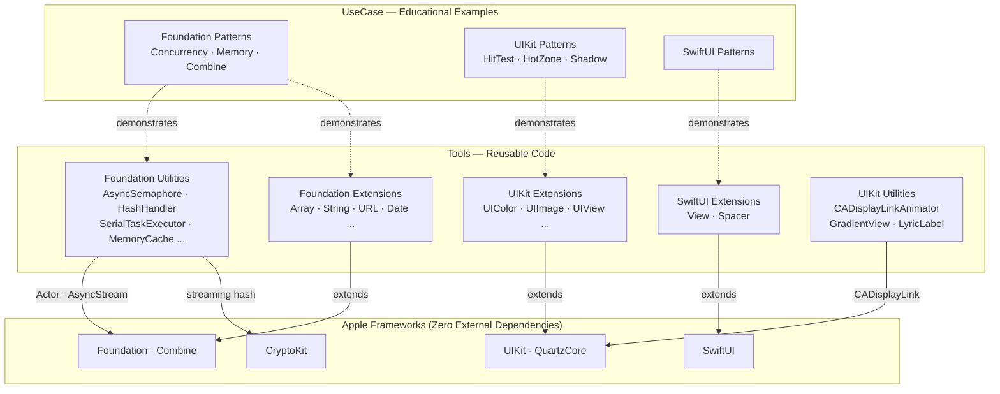

<h1 align="center">SwiftCodeBook</h1>

<p align="center"><strong>A comprehensive Swift utility library and learning resource for Apple platform development.</strong></p>

<p align="center">
  <a href="https://github.com/yuman07/SwiftCodeBook/stargazers"></a>
  <br>
  
  
  
  <a href="LICENSE"></a>
</p>

<p align="center"><a href="README.md">English</a> | <a href="README_ZH.md">中文</a></p>

---

## What is SwiftCodeBook?

SwiftCodeBook is a Swift utility library and educational reference for Apple platform development. It provides 50 production-ready extensions and utility classes alongside 24 educational examples — all built with **zero external dependencies**, using only Apple's native frameworks.

The project is organized into three parts:

- **Tools** — 50 reusable files: type extensions for Foundation, UIKit, and SwiftUI, plus standalone utility classes for concurrency, hashing, caching, animation, and more.
- **UseCase** — 24 self-contained educational examples covering concurrency patterns, memory management, Combine, property wrappers, KVO, UIKit techniques, and SwiftUI patterns.
- **Note.swift** — A curated bilingual (Chinese/English) reference of real-world development pitfalls and best practices.

<details>
<summary><strong>Foundation Extensions</strong> — 24 files</summary>

| Extension | Highlights |
|:---|:---|
| `Array+Tools` | Safe subscript, JSON conversion, plist loading, duplicate removal |
| `AttributedString+Tools` | AttributedString manipulation utilities |
| `BinaryFloatingPoint+Tools` | Floating-point comparison and formatting |
| `CGSize+Tools` | CGSize arithmetic and transformation |
| `Character+Tools` | Character classification and conversion |
| `Data+Tools` | Data manipulation and conversion |
| `Date+Tools` | Calendar components, date arithmetic, comparisons |
| `DateFormatter+Tools` | Preconfigured DateFormatter instances |
| `Dictionary+Tools` | JSON serialization, plist file loading |
| `DispatchQueue+Tools` | Dispatch queue convenience methods |
| `Duration+Tools` | Duration formatting and conversion |
| `FileManager+Tools` | Path shortcuts (documents, cache, tmp), concurrent file size calculation |
| `ISO8601DateFormatter+Tools` | ISO 8601 date formatting |
| `JSONCoder+Tools` | JSONEncoder/JSONDecoder configuration helpers |
| `Locale+Tools` | Locale detection and formatting |
| `NSAttributedString+Tools` | NSAttributedString creation and manipulation |
| `NSNumber+Tools` | NSNumber type conversion |
| `NSRange+Tools` | NSRange validation and conversion |
| `NSString+Tools` | NSString bridging utilities |
| `Publisher+Tools` | Combine publisher operators and helpers |
| `Result+Tools` | Result type convenience methods |
| `String+Tools` | Range conversion (NSRange ↔ Range), language direction detection |
| `Task+Tools` | Task-to-AnyCancellable bridge, structured concurrency helpers |
| `URL+Tools` | Query dictionary parsing, query item manipulation |

</details>

<details>
<summary><strong>UIKit Extensions</strong> — 7 files</summary>

| Extension | Highlights |
|:---|:---|
| `UIBezierPath+Tools` | Bezier path construction helpers |
| `UIColor+Tools` | Hex string parsing, RGBA extraction, hex generation |
| `UIFont+Tools` | Font creation and system font utilities |
| `UIImage+Tools` | Color-based creation, orientation fix, SF Symbol initialization |
| `UIStackView+Tools` | Stack view configuration shortcuts |
| `UIView+Tools` | View hierarchy and layout helpers |
| `UIViewController+Tools` | View controller presentation utilities |

</details>

<details>
<summary><strong>SwiftUI Extensions</strong> — 2 files</summary>

| Extension | Highlights |
|:---|:---|
| `View+Tools` | `modify()`, `onSizeChange()`, `onSafeAreaInsetsChange()`, `onWindowSizeChange()`, `onInterfaceOrientationChange()` |
| `Spacer+Tools` | Spacer convenience initializers |

</details>

<details>
<summary><strong>Foundation Utilities</strong> — 12 files</summary>

| Utility | Description |
|:---|:---|
| `AnyJSONValue` | Type-erased JSON value with Codable/Hashable conformance and safe accessors |
| `AsyncSemaphore` | Actor-based async/await semaphore |
| `CancelBag` | Thread-safe Combine subscription management via `OSAllocatedUnfairLock` |
| `CurrentApplication` | App metadata (name, version, build, bundle ID), key window, real-time memory usage |
| `CurrentDevice` | Device info (model, OS version, disk space), simulator detection, device type classification |
| `CurrentValuePublisher` | Protocol and type-erased wrapper for current-value publishers |
| `HashHandler` | Multi-algorithm hashing (MD5, SHA1, SHA256, SHA384, SHA512) with 64 KB streaming |
| `MemoryCache` | Type-safe `NSCache` wrapper with automatic cleanup on memory warnings |
| `SendablePassthroughSubject` | Thread-safe Combine `PassthroughSubject` using `NSRecursiveLock` |
| `SerialTaskExecutor` | `AsyncStream`-based serial task queue with guaranteed execution order |
| `WeakObject` | Generic weak reference wrapper for `AnyObject` types |
| `XMLNodeParser` | Recursive XML node parsing with dictionary output |

</details>

<details>
<summary><strong>UIKit Utilities</strong> — 5 files</summary>

| Utility | Description |
|:---|:---|
| `CADisplayLinkAnimator` | Duration-based animator with cubic Bezier timing and configurable frame rate |
| `CADisplayLinkTimer` | Display link-based timer with elapsed time tracking |
| `GradientView` | `UIView` subclass backed by `CAGradientLayer` |
| `LyricHighlightingLabel` | Single-line label with progress-based text highlighting |
| `UIInterfaceOrientation` | Interface orientation detection and conversion |

</details>

<details>
<summary><strong>Use Cases</strong> — 24 educational examples</summary>

| Topic | Content |
|:---|:---|
| **Concurrency** | Structured concurrency, AsyncStream serial execution, Task scheduling, GCD |
| **Memory & Pointers** | Pointer types, memory layout, unsafe operations, thread-safe lazy initialization |
| **Combine** | Publisher patterns, subscription management |
| **Property Wrappers** | Value clamping (`@Limit0To1`, `@LimitAToB`), `@UserDefaultWrapper` |
| **Associated Objects** | Runtime property storage for classes and protocols via `OSAllocatedUnfairLock` |
| **KVO** | Key-Value Observing patterns and timing considerations |
| **Enums & Types** | Enum comparison, type switching, OptionSet usage |
| **Hit Testing & Touch** | Custom hit test for out-of-bounds subviews, touch target expansion |
| **Animation & Layout** | Auto Layout constraint animation, shadow rendering optimization |
| **Scroll & Views** | Scroll state detection, content mode behavior, view lifecycle |
| **Text & WebView** | Tappable text in UITextView, zoom-disabled WKWebView |
| **SwiftUI** | NSAttributedString to SwiftUI conversion |

</details>

<details>
<summary><strong>Development Notes</strong> — Note.swift</summary>

A bilingual (Chinese/English) reference of real-world iOS/macOS development pitfalls covering:

> Signed/unsigned number edge cases, floating-point traps (NaN, Infinity), file system case sensitivity (simulator vs. device), memory management in dealloc, UIControl vs. Cell selected state conflicts, SwiftUI view refresh optimization, Combine publisher timing quirks (`@Published` vs. `CurrentValueSubject`), lock usage with async/await, integer version comparison, and more.

</details>

## Features

- **Swift 6.0 Strict Concurrency** — Full async/await, actors, and Sendable conformance throughout
- **Thread-Safe by Design** — Uses actors, `OSAllocatedUnfairLock`, and `NSRecursiveLock` for safe concurrent access
- **Multi-Platform** — iOS, macOS, tvOS, watchOS, and visionOS with platform-aware conditional compilation (`#if os(...)`, `#if canImport(...)`)
- **Zero Dependencies** — Built entirely on Apple's native frameworks: Foundation, UIKit, SwiftUI, Combine, CryptoKit, QuartzCore
- **Bilingual Documentation** — Code comments and development notes in both Chinese and English

## Development

> Building is only supported on macOS.

### Prerequisites

| Requirement | Minimum Version |
|:---|:---|
| macOS | 15.6+ (Sequoia) |
| Xcode | 26+ |

### Build Steps

```bash
# 1. Clone the repository
git clone https://github.com/yuman07/SwiftCodeBook.git

# 2. Navigate to the project directory
cd SwiftCodeBook

# 3. Open the project in Xcode
open SwiftCodeBook.xcodeproj

# 4. Select a target scheme and simulator, then build (⌘B) or run (⌘R)
```

## Technical Overview

SwiftCodeBook follows a two-layer architecture separating **reusable tools** from **educational examples**, with platform-aware conditional compilation across five Apple platforms.

The **Tools layer** is split into two categories: *Extensions* add capabilities to existing Apple framework types (Foundation, UIKit, SwiftUI), while *Utility Classes* are standalone components for concurrency, hashing, caching, and UI animation. The **UseCase layer** contains self-contained educational examples that demonstrate patterns and techniques — each file focuses on a single topic and can be understood independently.

The concurrency model is a key design highlight. Rather than a one-size-fits-all approach, the project demonstrates multiple thread-safety strategies matched to their use cases:

- **Actors** power `AsyncSemaphore` — leveraging Swift's built-in isolation for clean async coordination
- **`OSAllocatedUnfairLock`** protects `CancelBag` and `AssociatedObject` — minimal-overhead locking for simple mutable state
- **`NSRecursiveLock`** wraps `SendablePassthroughSubject` — reentrant safety when bridging Combine subjects to Sendable
- **`AsyncStream`** drives `SerialTaskExecutor` — guaranteeing serial execution order through stream-based task queuing

`HashHandler` uses CryptoKit with a streaming API that processes data in 64 KB chunks, keeping memory constant regardless of file size. `MemoryCache` wraps `NSCache` with type safety and subscribes to memory warning publishers from `CurrentApplication` for automatic cleanup. `CADisplayLinkAnimator` implements a full animation system with cubic Bezier timing functions parsed from `CAMediaTimingFunction` control points.

### Tech Stack

| Category | Technologies |
|:---|:---|
| Language | Swift 6.0 (strict concurrency mode) |
| UI Frameworks | SwiftUI, UIKit, AppKit, WatchKit |
| Reactive | Combine |
| Cryptography | CryptoKit |
| Animation | QuartzCore (CADisplayLink, CAGradientLayer) |
| Concurrency | async/await, Actor, AsyncStream, OSAllocatedUnfairLock |
| Platforms | iOS 26+, macOS 26+, tvOS 26+, watchOS 26+, visionOS 26+ |
| Build Tool | Xcode 26+ |

### Architecture



- **Tools to Frameworks (solid arrows)** — Extensions directly extend types from Apple frameworks; Foundation Utilities use Actor isolation and AsyncStream from the Swift runtime, while HashHandler streams through CryptoKit; UIKit Utilities leverage CADisplayLink for frame-synchronized animation
- **UseCase to Tools (dashed arrows)** — Educational examples demonstrate patterns found in the Tools layer; Foundation use cases cover both utility classes (e.g., SerialTaskExecutor concurrency patterns) and extension techniques (e.g., pointer and memory operations)
- **Zero External Dependencies** — Every arrow terminates at an Apple framework, confirming the project relies entirely on the native platform SDK

### Project Structure

```
SwiftCodeBook/
|-- SwiftCodeBookApp.swift              # SwiftUI app entry point
|-- Watch Watch App/
|   |-- WatchApp.swift                  # watchOS app entry point
|   `-- ContentView.swift               # watchOS main view
`-- Source/
    |-- Note.swift                      # Development pitfalls (bilingual)
    |-- Tools/
    |   |-- Extension/
    |   |   |-- Foundation/             # 24 Foundation type extensions
    |   |   |-- UIKit/                  # 7 UIKit type extensions
    |   |   `-- SwiftUI/               # 2 SwiftUI type extensions
    |   |-- Foundation/                 # 12 standalone utility classes
    |   `-- UIKit/                      # 5 UIKit utility classes
    `-- UseCase/
        |-- Foundation/                 # 13 Foundation pattern examples
        |-- UIKit/                      # 10 UIKit pattern examples
        `-- SwiftUI/                    # 1 SwiftUI pattern example
```

## License

This project is licensed under the [MIT License](LICENSE).
