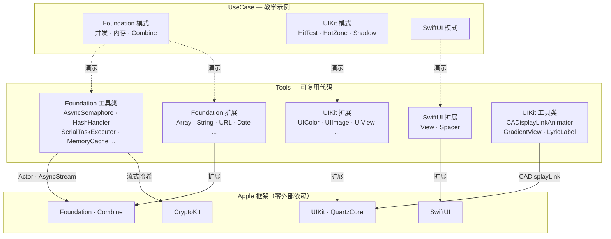

<h1 align="center">SwiftCodeBook</h1>

<p align="center"><strong>面向 Apple 全平台开发的 Swift 工具库与学习资源。</strong></p>

<p align="center">
  <a href="https://github.com/yuman07/SwiftCodeBook/stargazers"></a>
  <br>
  
  
  
  <a href="LICENSE"></a>
</p>

<p align="center"><a href="README.md">English</a> | <a href="README_ZH.md">中文</a></p>

---

## SwiftCodeBook 是什么？

SwiftCodeBook 是一个面向 Apple 平台开发的 Swift 工具库与教学参考项目。它包含 50 个生产级扩展和工具类，以及 24 个教学示例 — 全部基于 Apple 原生框架构建，**零外部依赖**。

项目分为三个部分：

- **Tools** — 50 个可复用文件：Foundation、UIKit、SwiftUI 的类型扩展，以及用于并发、哈希、缓存、动画等的独立工具类。
- **UseCase** — 24 个独立教学示例，涵盖并发模式、内存管理、Combine、属性包装器、KVO、UIKit 技巧和 SwiftUI 模式。
- **Note.swift** — 精心整理的中英双语开发踩坑记录与最佳实践。

<details>
<summary><strong>Foundation 扩展</strong> — 24 个文件</summary>

| 扩展 | 功能亮点 |
|:---|:---|
| `Array+Tools` | 安全下标访问、JSON 转换、plist 加载、去重 |
| `AttributedString+Tools` | AttributedString 操作工具 |
| `BinaryFloatingPoint+Tools` | 浮点数比较与格式化 |
| `CGSize+Tools` | CGSize 运算与变换 |
| `Character+Tools` | 字符分类与转换 |
| `Data+Tools` | 数据操作与转换 |
| `Date+Tools` | 日历组件、日期运算、日期比较 |
| `DateFormatter+Tools` | 预配置的 DateFormatter 实例 |
| `Dictionary+Tools` | JSON 序列化、plist 文件加载 |
| `DispatchQueue+Tools` | Dispatch 队列便捷方法 |
| `Duration+Tools` | Duration 格式化与转换 |
| `FileManager+Tools` | 路径快捷方式（documents、cache、tmp）、并发文件大小计算 |
| `ISO8601DateFormatter+Tools` | ISO 8601 日期格式化 |
| `JSONCoder+Tools` | JSONEncoder/JSONDecoder 配置辅助 |
| `Locale+Tools` | 区域检测与格式化 |
| `NSAttributedString+Tools` | NSAttributedString 创建与操作 |
| `NSNumber+Tools` | NSNumber 类型转换 |
| `NSRange+Tools` | NSRange 校验与转换 |
| `NSString+Tools` | NSString 桥接工具 |
| `Publisher+Tools` | Combine Publisher 操作符与辅助方法 |
| `Result+Tools` | Result 类型便捷方法 |
| `String+Tools` | Range 转换（NSRange ↔ Range）、语言方向检测 |
| `Task+Tools` | Task 转 AnyCancellable 桥接、结构化并发辅助 |
| `URL+Tools` | Query 字典解析、Query 参数操作 |

</details>

<details>
<summary><strong>UIKit 扩展</strong> — 7 个文件</summary>

| 扩展 | 功能亮点 |
|:---|:---|
| `UIBezierPath+Tools` | 贝塞尔路径构建辅助 |
| `UIColor+Tools` | 十六进制颜色解析、RGBA 提取、十六进制生成 |
| `UIFont+Tools` | 字体创建与系统字体工具 |
| `UIImage+Tools` | 基于颜色创建图片、方向修正、SF Symbol 初始化 |
| `UIStackView+Tools` | StackView 配置快捷方法 |
| `UIView+Tools` | 视图层级与布局辅助 |
| `UIViewController+Tools` | 视图控制器展示工具 |

</details>

<details>
<summary><strong>SwiftUI 扩展</strong> — 2 个文件</summary>

| 扩展 | 功能亮点 |
|:---|:---|
| `View+Tools` | `modify()`、`onSizeChange()`、`onSafeAreaInsetsChange()`、`onWindowSizeChange()`、`onInterfaceOrientationChange()` |
| `Spacer+Tools` | Spacer 便捷初始化 |

</details>

<details>
<summary><strong>Foundation 工具类</strong> — 12 个文件</summary>

| 工具 | 说明 |
|:---|:---|
| `AnyJSONValue` | 类型擦除的 JSON 值，支持 Codable/Hashable 和安全访问 |
| `AsyncSemaphore` | 基于 Actor 的 async/await 信号量 |
| `CancelBag` | 基于 `OSAllocatedUnfairLock` 的线程安全 Combine 订阅管理 |
| `CurrentApplication` | 应用元信息（名称、版本、Build 号、Bundle ID）、Key Window、实时内存使用量 |
| `CurrentDevice` | 设备信息（型号、系统版本、磁盘空间）、模拟器检测、设备类型分类 |
| `CurrentValuePublisher` | 当前值 Publisher 的协议与类型擦除封装 |
| `HashHandler` | 多算法哈希（MD5、SHA1、SHA256、SHA384、SHA512），64 KB 流式处理 |
| `MemoryCache` | 类型安全的 `NSCache` 封装，内存警告时自动清理 |
| `SendablePassthroughSubject` | 基于 `NSRecursiveLock` 的线程安全 Combine `PassthroughSubject` |
| `SerialTaskExecutor` | 基于 `AsyncStream` 的串行任务队列，保证执行顺序 |
| `WeakObject` | 泛型弱引用包装器 |
| `XMLNodeParser` | 递归 XML 节点解析，输出字典 |

</details>

<details>
<summary><strong>UIKit 工具类</strong> — 5 个文件</summary>

| 工具 | 说明 |
|:---|:---|
| `CADisplayLinkAnimator` | 基于时长的动画器，支持三次贝塞尔时间函数和可配帧率 |
| `CADisplayLinkTimer` | 基于 DisplayLink 的计时器，支持已用时间追踪 |
| `GradientView` | 以 `CAGradientLayer` 为底层的渐变视图 |
| `LyricHighlightingLabel` | 基于进度的单行文字高亮 Label |
| `UIInterfaceOrientation` | 界面方向检测与转换 |

</details>

<details>
<summary><strong>用例</strong> — 24 个教学示例</summary>

| 主题 | 内容 |
|:---|:---|
| **并发** | 结构化并发、AsyncStream 串行执行、Task 调度、GCD |
| **内存与指针** | 指针类型、内存布局、Unsafe 操作、线程安全的延迟初始化 |
| **Combine** | Publisher 模式、订阅管理 |
| **属性包装器** | 值域限制（`@Limit0To1`、`@LimitAToB`）、`@UserDefaultWrapper` |
| **关联对象** | 基于 `OSAllocatedUnfairLock` 的类和协议运行时属性存储 |
| **KVO** | 键值观察模式与时序注意事项 |
| **枚举与类型** | 枚举比较、类型切换、OptionSet 用法 |
| **点击测试与触摸** | 超出边界子视图的自定义 Hit Test、触摸热区扩大 |
| **动画与布局** | Auto Layout 约束动画、阴影渲染优化 |
| **滚动与视图** | 滚动状态检测、Content Mode 行为、视图生命周期 |
| **文本与 WebView** | UITextView 可点击文本、禁止缩放的 WKWebView |
| **SwiftUI** | NSAttributedString 到 SwiftUI 的转换 |

</details>

<details>
<summary><strong>开发笔记</strong> — Note.swift</summary>

中英双语的 iOS/macOS 实战踩坑记录，涵盖：

> 有符号/无符号数边界问题、浮点数陷阱（NaN、Infinity）、文件系统大小写敏感性差异（模拟器 vs. 真机）、dealloc 中的内存管理、UIControl 与 Cell 的 selected 状态冲突、SwiftUI 视图刷新优化、Combine Publisher 时序问题（`@Published` vs. `CurrentValueSubject`）、async/await 中的锁使用、整数版本号比较，以及更多内容。

</details>

## 特性

- **Swift 6.0 严格并发** — 全面使用 async/await、Actor 和 Sendable
- **线程安全设计** — 使用 Actor、`OSAllocatedUnfairLock`、`NSRecursiveLock` 保证并发安全
- **多平台支持** — iOS、macOS、tvOS、watchOS、visionOS，通过 `#if os(...)`、`#if canImport(...)` 实现平台感知编译
- **零外部依赖** — 完全基于 Apple 原生框架：Foundation、UIKit、SwiftUI、Combine、CryptoKit、QuartzCore
- **中英双语文档** — 代码注释与开发笔记均提供中英双语

## 开发

> 仅支持在 macOS 上构建。

### 前置要求

| 要求 | 最低版本 |
|:---|:---|
| macOS | 15.6+（Sequoia） |
| Xcode | 26+ |

### 构建步骤

```bash
# 1. 克隆仓库
git clone https://github.com/yuman07/SwiftCodeBook.git

# 2. 进入项目目录
cd SwiftCodeBook

# 3. 用 Xcode 打开项目
open SwiftCodeBook.xcodeproj

# 4. 选择目标 Scheme 和模拟器，然后构建（⌘B）或运行（⌘R）
```

## 技术概览

SwiftCodeBook 采用双层架构，将**可复用工具**与**教学示例**分离，通过平台感知的条件编译支持五个 Apple 平台。

**Tools 层**分为两类：*扩展*为已有的 Apple 框架类型（Foundation、UIKit、SwiftUI）添加功能，*工具类*则是用于并发、哈希、缓存和 UI 动画的独立组件。**UseCase 层**包含独立的教学示例，展示各种模式与技巧 — 每个文件聚焦一个主题，可独立阅读。

并发模型是核心设计亮点。项目没有采用单一方案，而是展示了多种线程安全策略，各自匹配最适合的使用场景：

- **Actor** 驱动 `AsyncSemaphore` — 利用 Swift 内置的隔离机制实现简洁的异步协调
- **`OSAllocatedUnfairLock`** 保护 `CancelBag` 和 `AssociatedObject` — 为简单可变状态提供最小开销的锁
- **`NSRecursiveLock`** 包装 `SendablePassthroughSubject` — 将 Combine Subject 桥接到 Sendable 时提供可重入安全
- **`AsyncStream`** 驱动 `SerialTaskExecutor` — 通过基于流的任务队列保证串行执行顺序

`HashHandler` 使用 CryptoKit 的流式 API，以 64 KB 为单位分块处理数据，无论文件多大内存使用始终恒定。`MemoryCache` 对 `NSCache` 进行类型安全封装，并订阅 `CurrentApplication` 的内存警告 Publisher 实现自动清理。`CADisplayLinkAnimator` 实现了完整的动画系统，从 `CAMediaTimingFunction` 的控制点解析三次贝塞尔时间函数。

### 技术栈

| 类别 | 技术 |
|:---|:---|
| 语言 | Swift 6.0（严格并发模式） |
| UI 框架 | SwiftUI、UIKit、AppKit、WatchKit |
| 响应式 | Combine |
| 密码学 | CryptoKit |
| 动画 | QuartzCore（CADisplayLink、CAGradientLayer） |
| 并发 | async/await、Actor、AsyncStream、OSAllocatedUnfairLock |
| 平台 | iOS 26+、macOS 26+、tvOS 26+、watchOS 26+、visionOS 26+ |
| 构建工具 | Xcode 26+ |

### 架构



- **Tools 到框架（实线箭头）** — 扩展直接扩展 Apple 框架类型；Foundation 工具类使用 Swift 运行时的 Actor 隔离和 AsyncStream，HashHandler 通过 CryptoKit 进行流式哈希；UIKit 工具类利用 CADisplayLink 实现帧同步动画
- **UseCase 到 Tools（虚线箭头）** — 教学示例展示 Tools 层的模式；Foundation 用例同时涵盖工具类（如 SerialTaskExecutor 的并发模式）和扩展技巧（如指针与内存操作）
- **零外部依赖** — 所有箭头都终止于 Apple 框架，表明项目完全依赖原生平台 SDK

### 项目结构

```
SwiftCodeBook/
|-- SwiftCodeBookApp.swift              # SwiftUI 应用入口
|-- Watch Watch App/
|   |-- WatchApp.swift                  # watchOS 应用入口
|   `-- ContentView.swift               # watchOS 主视图
`-- Source/
    |-- Note.swift                      # 开发踩坑记录（中英双语）
    |-- Tools/
    |   |-- Extension/
    |   |   |-- Foundation/             # 24 个 Foundation 类型扩展
    |   |   |-- UIKit/                  # 7 个 UIKit 类型扩展
    |   |   `-- SwiftUI/               # 2 个 SwiftUI 类型扩展
    |   |-- Foundation/                 # 12 个独立工具类
    |   `-- UIKit/                      # 5 个 UIKit 工具类
    `-- UseCase/
        |-- Foundation/                 # 13 个 Foundation 模式示例
        |-- UIKit/                      # 10 个 UIKit 模式示例
        `-- SwiftUI/                    # 1 个 SwiftUI 模式示例
```

## 许可证

本项目基于 [MIT License](LICENSE) 开源。
